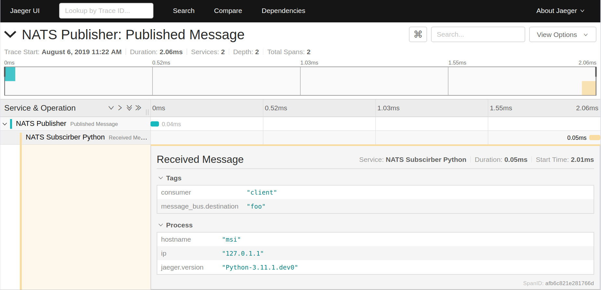

# not.py
Update https://github.com/nats-io/not.go to Python Code


## Try 

```
python3 sub.py foo
go run not.go pub.go "foo" "abcdef"
```

## Result

_jaeger_nats_python_with_go_
jaeger nats python with go


